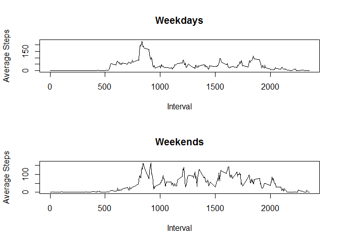

# Reproducible Research: Peer Assessment 1


## Loading and preprocessing the data

Data was read in from the activity.csv file.  A clean copy was made by removing all NA occurrences.


```r
library(plyr)
setwd("~/Coursera/RepData_PeerAssessment1")
data <- read.csv("activity.csv")
summary(data)
```

```
##      steps               date          interval   
##  Min.   :  0.0   2012-10-01:  288   Min.   :   0  
##  1st Qu.:  0.0   2012-10-02:  288   1st Qu.: 589  
##  Median :  0.0   2012-10-03:  288   Median :1178  
##  Mean   : 37.4   2012-10-04:  288   Mean   :1178  
##  3rd Qu.: 12.0   2012-10-05:  288   3rd Qu.:1766  
##  Max.   :806.0   2012-10-06:  288   Max.   :2355  
##  NA's   :2304    (Other)   :15840
```

```r
clean_data <- na.omit(data)
summary(clean_data)
```

```
##      steps               date          interval   
##  Min.   :  0.0   2012-10-02:  288   Min.   :   0  
##  1st Qu.:  0.0   2012-10-03:  288   1st Qu.: 589  
##  Median :  0.0   2012-10-04:  288   Median :1178  
##  Mean   : 37.4   2012-10-05:  288   Mean   :1178  
##  3rd Qu.: 12.0   2012-10-06:  288   3rd Qu.:1766  
##  Max.   :806.0   2012-10-07:  288   Max.   :2355  
##                  (Other)   :13536
```

## What is mean total number of steps taken per day?

From the clean data set, daily step values were summed.

The mean number of steps taken was 10766.  The median number of steps was 10765.


```r
daily_data <- ddply(clean_data, "date", summarize, sum_of_steps = sum(steps))

hist(daily_data$sum_of_steps, xlab = "Daily Step Count", ylab = "Number of Days", main = "Step Count Histogram")
```

 

```r
mean(daily_data$sum_of_steps)
```

```
## [1] 10766
```

```r
median(daily_data$sum_of_steps)
```

```
## [1] 10765
```

## What is the average daily activity pattern?

The number of steps for each five minute interval were summed across each day. The resultant graph shows the average number of steps taken during the average day.


```r
interval_data <- ddply(clean_data, "interval", summarize, average = mean(steps))

plot (interval_data$interval, interval_data$average, type = "l", xlab = "Interval", ylab = "Steps")
```

 

```r
max_interval_value = max(interval_data$average)

max_interval_subset = subset (interval_data, interval_data$average == max_interval_value)

max_interval = max_interval_subset$interval
```

## Imputing missing values

There were 2304 step values missing from the original data set.  These were assigned the average from existing values in the same interval across other days.  Mean and median values were both 10766.


```r
summary(data)
```

```
##      steps               date          interval   
##  Min.   :  0.0   2012-10-01:  288   Min.   :   0  
##  1st Qu.:  0.0   2012-10-02:  288   1st Qu.: 589  
##  Median :  0.0   2012-10-03:  288   Median :1178  
##  Mean   : 37.4   2012-10-04:  288   Mean   :1178  
##  3rd Qu.: 12.0   2012-10-05:  288   3rd Qu.:1766  
##  Max.   :806.0   2012-10-06:  288   Max.   :2355  
##  NA's   :2304    (Other)   :15840
```

```r
number_of_NA <- length(which(is.na(data$steps)))

interval_mean <- ddply(clean_data, "interval", summarize, value = mean(steps))

imput_data <- data

for (counter in 1:nrow(imput_data))
  {if (is.na(imput_data$steps[counter])) 
    {imput_data$steps[counter] <- interval_mean$value[(counter %% 288) + 1]}
  }

summary(imput_data)
```

```
##      steps               date          interval   
##  Min.   :  0.0   2012-10-01:  288   Min.   :   0  
##  1st Qu.:  0.0   2012-10-02:  288   1st Qu.: 589  
##  Median :  0.0   2012-10-03:  288   Median :1178  
##  Mean   : 37.4   2012-10-04:  288   Mean   :1178  
##  3rd Qu.: 27.0   2012-10-05:  288   3rd Qu.:1766  
##  Max.   :806.0   2012-10-06:  288   Max.   :2355  
##                  (Other)   :15840
```

```r
imput_daily_data <- ddply(imput_data, "date", summarize, sum_of_steps = sum(steps))

hist(imput_daily_data$sum_of_steps, xlab = "Daily Step Count", ylab = "Number of Days", main = "Step Count Histogram")
```

 

```r
mean(imput_daily_data$sum_of_steps)
```

```
## [1] 10766
```

```r
median(imput_daily_data$sum_of_steps)
```

```
## [1] 10766
```


## Are there differences in activity patterns between weekdays and weekends?

Weekday and weekend data was split and graphed to identify patterns specific to each time frame.


```r
day_of_week_data <- cbind(imput_data, weekdays(as.POSIXct(imput_data$date)))

names(day_of_week_data)[4] <- paste("day")

day_or_end_data <- cbind(day_of_week_data, 1)

names(day_or_end_data)[5] <- paste("value")

for (counter in 1:nrow(day_or_end_data))
  {if (day_or_end_data$day[counter] == "Saturday") {day_or_end_data$value[counter] = 2}
   else if (day_or_end_data$day[counter] == "Sunday") {day_or_end_data$value[counter] = 2}
   else {day_or_end_data$value[counter] = as.factor(1)}
  }

day_or_end_data$value <- as.factor(day_or_end_data$value)

levels(day_or_end_data$value) = c("Weekday", "Weekend")

summary(day_or_end_data)
```

```
##      steps               date          interval           day      
##  Min.   :  0.0   2012-10-01:  288   Min.   :   0   Friday   :2592  
##  1st Qu.:  0.0   2012-10-02:  288   1st Qu.: 589   Monday   :2592  
##  Median :  0.0   2012-10-03:  288   Median :1178   Saturday :2304  
##  Mean   : 37.4   2012-10-04:  288   Mean   :1178   Sunday   :2304  
##  3rd Qu.: 27.0   2012-10-05:  288   3rd Qu.:1766   Thursday :2592  
##  Max.   :806.0   2012-10-06:  288   Max.   :2355   Tuesday  :2592  
##                  (Other)   :15840                  Wednesday:2592  
##      value      
##  Weekday:12960  
##  Weekend: 4608  
##                 
##                 
##                 
##                 
## 
```

```r
end_or_day_interval_data <- ddply(day_or_end_data, .(interval, value), summarize, average = mean(steps))

weekday_data = subset(end_or_day_interval_data, end_or_day_interval_data$value == "Weekday")
weekend_data = subset(end_or_day_interval_data, end_or_day_interval_data$value == "Weekend")

par(mfrow = c(2,1))
#upper plot
plot(weekday_data$interval, weekday_data$average, type="l", xlab="Interval", ylab="Average Steps", main="Weekdays")
#lower plot
plot(weekend_data$interval, weekend_data$average, type="l", xlab="Interval", ylab="Average Steps", main="Weekends")
```

 

